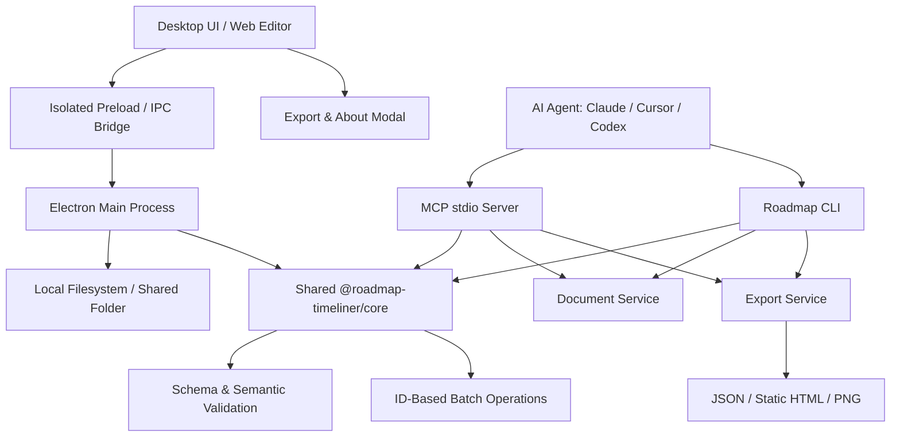

# Roadmap Timeliner — Architecture & System Design

Status: Initial architecture implemented (2026-09-13). Scope follows `PLAN.md`. Built with Electron + TypeScript + npm workspaces.

---

## 1. Core Architecture

The fundamental unit of work is an in-memory roadmap snapshot:
- **Opening a file** creates an active snapshot.
- **Editing** mutates this snapshot in memory.
- **Saving** serializes and validates the snapshot before writing atomically to the filesystem.
- **Exporting** clones the current snapshot into target formats (HTML, PNG, JSON, PDF) without modifying disk state.

---

## 2. Package Responsibilities and Boundaries

| Package | Ownership & Responsibility | Dependency Constraints |
| --- | --- | --- |
| **`@roadmap-timeliner/core`** | Canonical JSON contracts, `strict` and `compatible` validation, ID-based patch operations, and immutable diffs | Zero dependencies on Electron, Node filesystem, or AI SDKs |
| **`@roadmap-timeliner/document-service`** | Session management, dirty tracking, undo/redo stacks, and atomic file port interfaces | Depends only on `@roadmap-timeliner/core` and standard Node ports |
| **`@roadmap-timeliner/export`** | Clean JSON formatting and portable static HTML generation | Pure serialization; no filesystem mutations |
| **`@roadmap-timeliner/cli`** | Command-line parsing, formatted outputs, exit codes, and environment setup commands | Calls `@roadmap-timeliner/document-service`, `@roadmap-timeliner/agent-kit` |
| **`@roadmap-timeliner/mcp`** | Model Context Protocol tools schema, JSON-RPC handling, and headless roadmap operations | Uses services directly without shelling out |
| **`@roadmap-timeliner/agent-kit`** | Portable agent skills, generation profiles, packaged schemas, and one-click AI client setup scripts | Synchronizes with root schema on build |
| **`@roadmap-timeliner/desktop`** | Electron main/preload processes, native application menus, file dialogs, and window lifecycle | Hosts `roadmap.html` with isolated bridge |

---

## 3. Data & Validation Contracts

All documents adhere to `version: "1.0"` matching `roadmap.schema.json`. Session metadata, file paths, and transient UI states remain outside the saved JSON document.

### Validation Modes
1. **`strict` Mode**:
   - Used for newly generated AI artifacts and schema authoring.
   - Enforces valid categories, items, statuses, and milestones without unexpected top-level or child properties.
   - Requires real calendar dates in `YYYY-MM-DD` format and chronological consistency (`start <= end`).
2. **`compatible` Mode**:
   - Used for opening and saving existing files.
   - Preserves unrecognized optional fields or custom attributes while validating known keys and preventing data corruption.
   - Ensures safe migration and round-trip editing without loss of user metadata.
